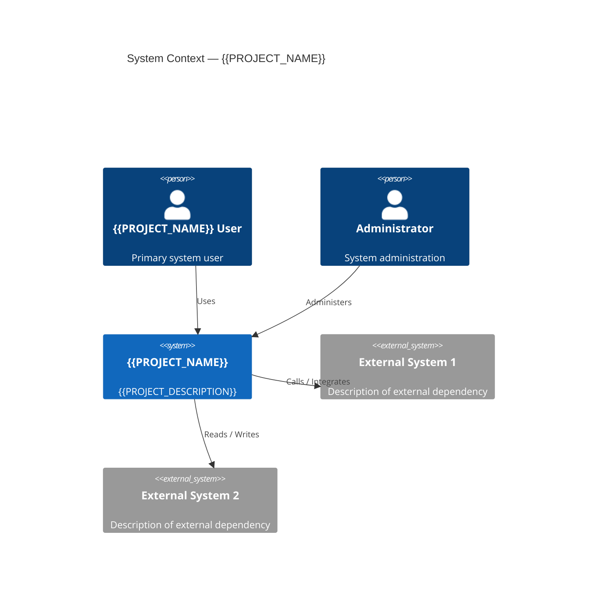
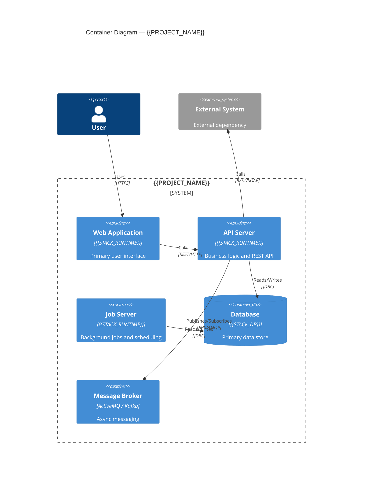
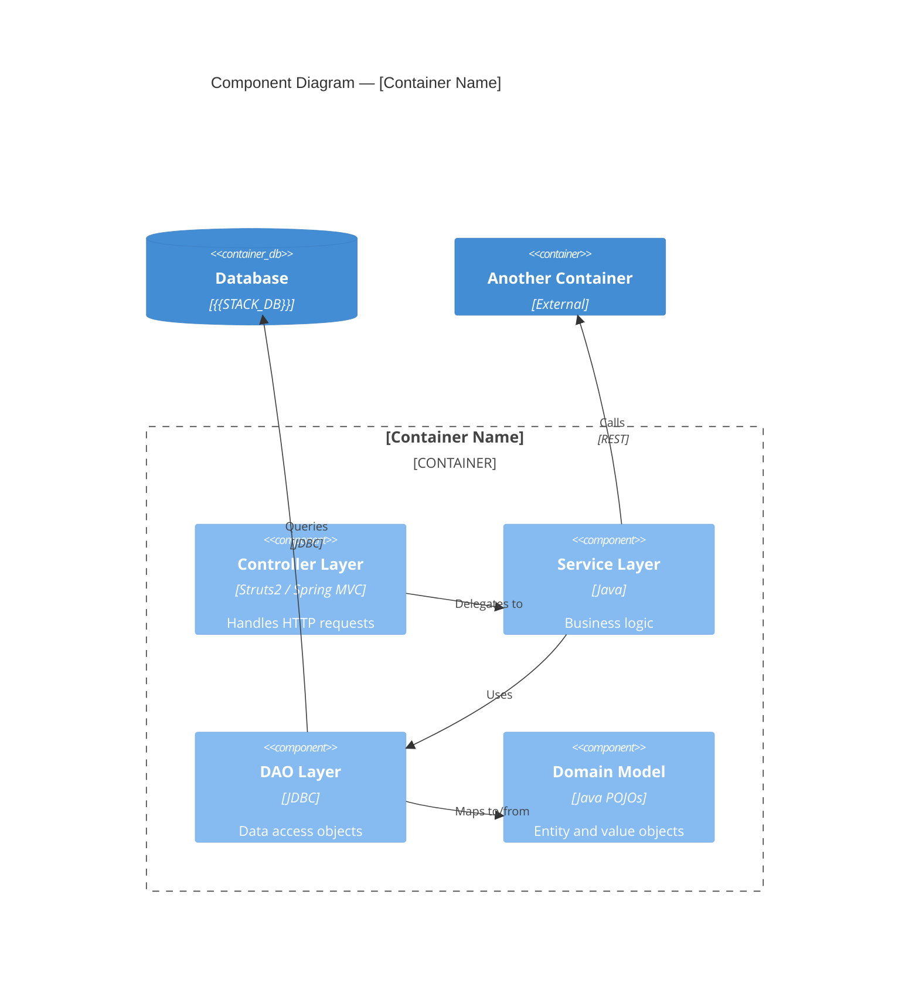
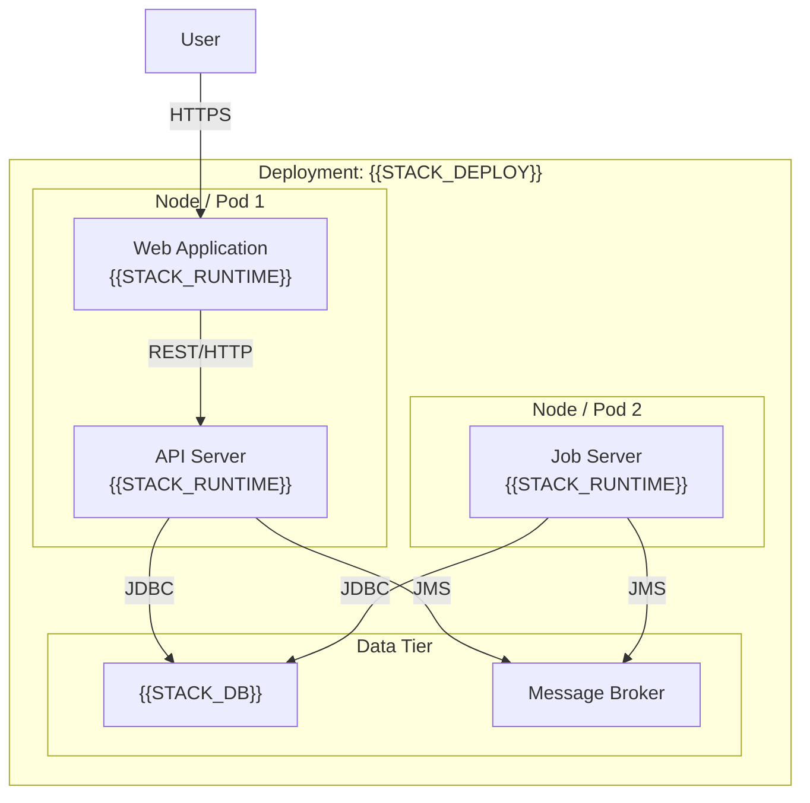

# {{PROJECT_NAME}} — Architecture

> C4 Model: Context, Container, Component
> Stack: {{STACK_RUNTIME}} | {{STACK_OS}} | {{STACK_DB}} | {{STACK_DEPLOY}}

---

## 1. System Context (Level 1)

*Answers: What does the system do? Who uses it? What external systems does it interact with?*

*[Replace placeholders above with actual actor names, system name, and real external dependencies.]*

---

## 2. Container Diagram (Level 2)

*Answers: What are the deployable units? What technologies do they use? How do they communicate?*

*[Add, remove, or rename containers to match actual deployment architecture.]*

---

## 3. Component Diagram (Level 3)

*Answers: What are the major components within a container? How do they interact?*

*Select the most complex or architecturally significant container to diagram at this level.*

### 3.1 [Container Name] Components

---

## 4. Deployment Diagram

*Describes the infrastructure environment: servers, containers, networking.*

---

## 5. Architecture Decisions

*Key architectural decisions that shaped this design.*

| Decision | ADR Reference | Date |
|---|---|---|
| *[Decision description]* | ADR-001 | {{DOC_DATE}} |

*Full decision log: `.github/mma/decisions/decisions-log.md`*

---

## 6. Known Constraints and Risks

| Constraint/Risk | Impact | Notes |
|---|---|---|
| *[e.g., Legacy OS EOL]* | *[High/Medium/Low]* | *[Mitigation or note]* |
| *[e.g., Library CVE]* | *[High/Medium/Low]* | *[Mitigation or note]* |

---

## 7. Document History

| Version | Date | Author | Summary |
|---|---|---|---|
| {{DOC_VERSION}} | {{DOC_DATE}} | {{ENG_A}} | Initial C4 architecture document |

---

*Document maintained by {{ORG_LEGAL}} — {{TEAM_NAME}}*
*Generated with M3A Team — Minsait Multi Agents Framework*
