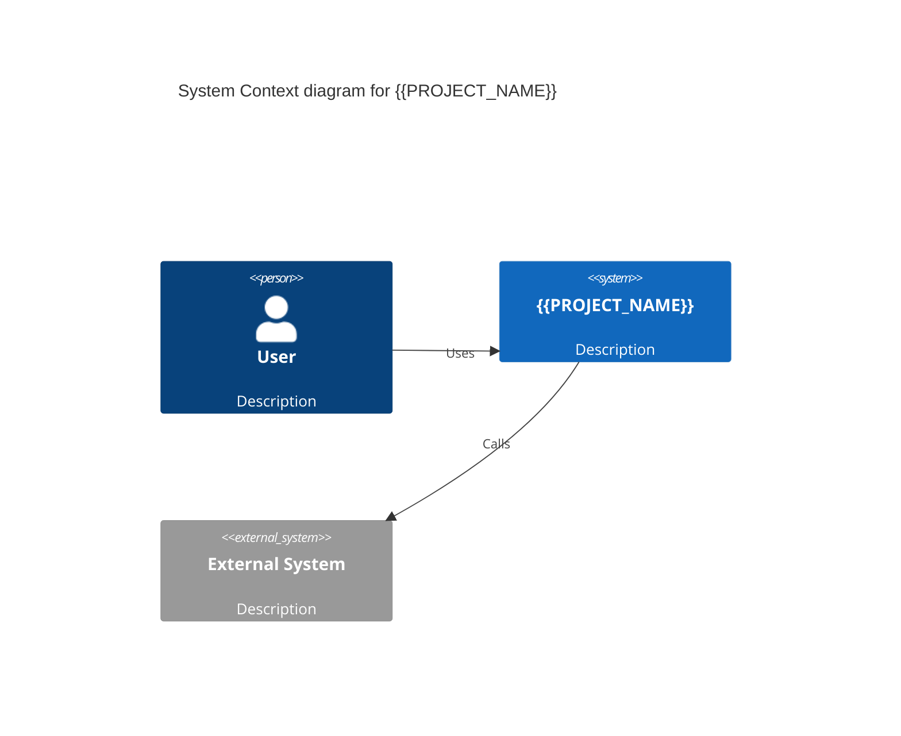
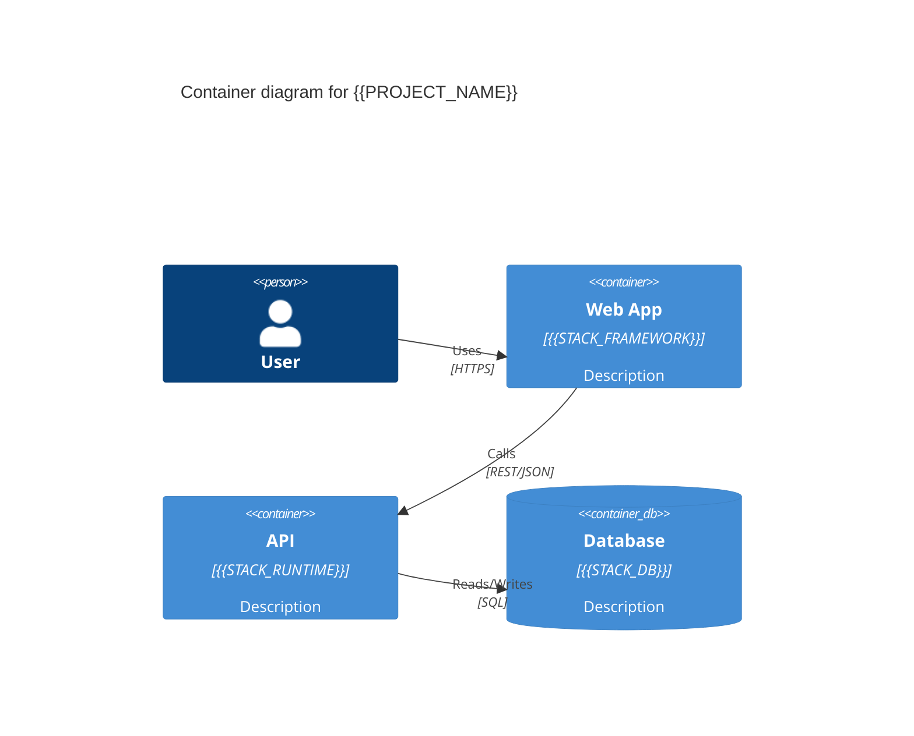
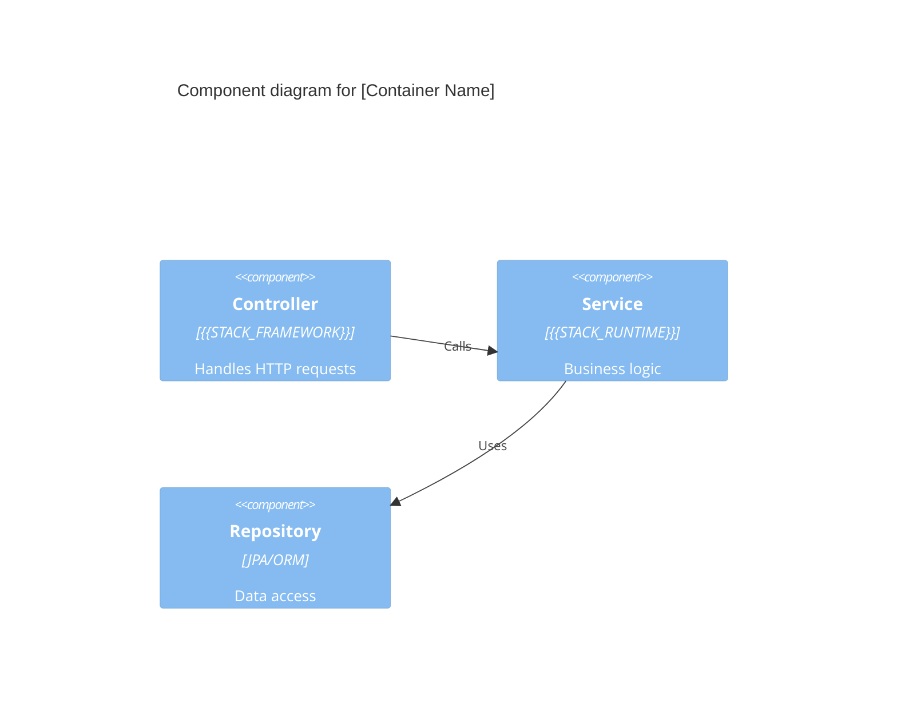

# /m3a-architecture-c4 — Generate C4 Diagrams

> **Visualize your architecture at multiple zoom levels.**
> Context → Container → Component — all in Mermaid.

---

## Behavior Rule

- **Stack-aware** — reads modules and dependencies from knowledge base
- **Mermaid output** — diagrams render in VS Code, GitHub, and portals
- **Incremental** — can generate one level or all three
- **Template-driven** — uses `templates/markdown/architecture-c4.md`

---

## STEP 0 — Verify Context

```
IF .github/mma/config.yaml DOES NOT EXIST:
  → "⚠️ Run /m3a-init first."
  → STOP

Read:
  - .github/mma/config.yaml → stack, project name
  - .github/mma/knowledge/project-architecture.md → modules, dependencies
  - .github/mma/knowledge/dependencies.md → external systems
```

---

## STEP 1 — Diagram Scope

```
"Which C4 levels do you want to generate?

[1] Context — system boundaries and external actors (recommended first)
[2] Container — runtime units (apps, DBs, message queues)
[3] Component — internal structure of a specific container
[4] All three levels

If Component: which container should I zoom into?"
```

---

## STEP 2 — Generate Diagrams

### Level 1: Context


### Level 2: Container


### Level 3: Component


---

## STEP 3 — Output

Save to: `docs/architecture-c4.md` (or `.github/mma/knowledge/project-architecture.md` appendix)

```
✅ C4 diagrams generated: docs/architecture-c4.md
  - Level 1: Context ✅
  - Level 2: Container ✅
  - Level 3: Component ✅ (for [container])
```

---

## Changelog

**v1.0.0 (2026-04-24)** — Skill created. C4 diagram generation in Mermaid from project knowledge base.
